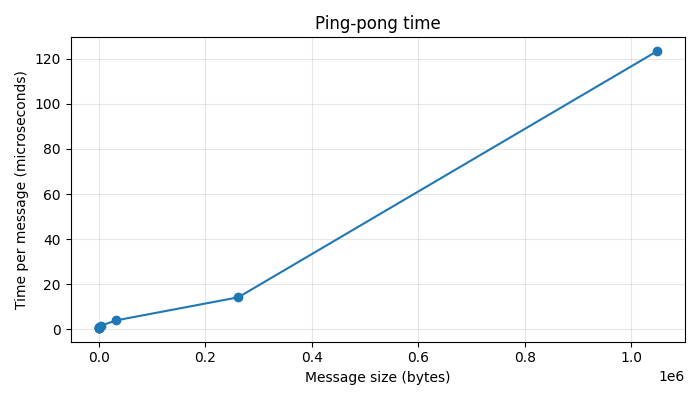
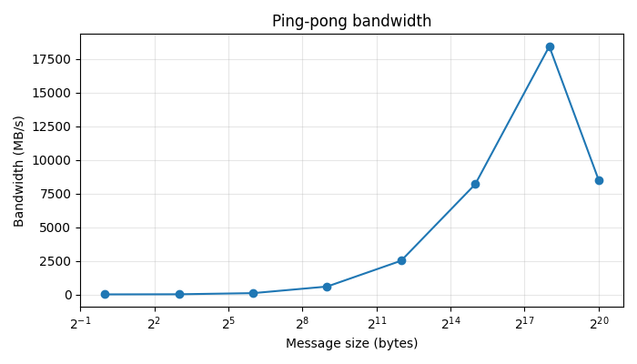
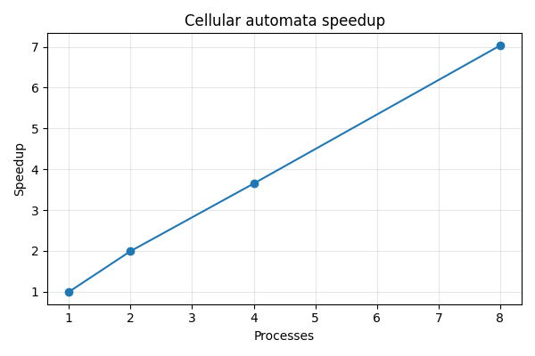
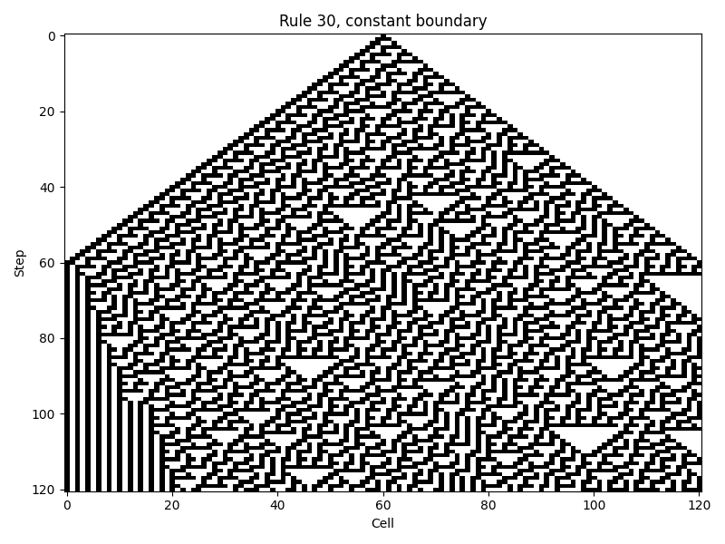
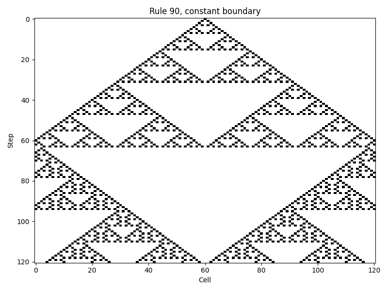
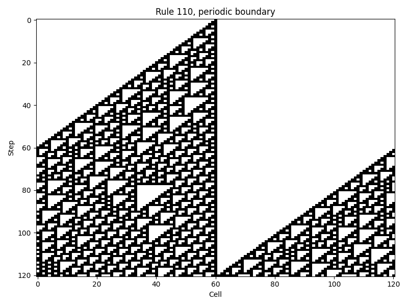

# HPC 2026 Homework 2: MPI in Python

- [ping_pong_names.py](ping_pong_names.py) - passes a message randomly between MPI processes a fixed number of times, printing the path it takes
- [ping_pong_benchmark.py](ping_pong_benchmark.py) - times how long it takes to send messages of various sizes back and forth between two MPI processes and saves the results to CSV
- [cellular_automata.py](cellular_automata.py) - runs a 1D cellular automaton in parallel using MPI with domain decomposition, either saving the full step history or benchmarking execution time.

## Setup

```bash
python3 -m venv .venv
.venv/bin/python -m pip install -r requirements.txt
```

## Execution

```bash
./scripts/run_ping_pong_names.sh
./scripts/run_ping_pong_benchmark.sh
./scripts/run_ca_rule_outputs.sh
./scripts/run_ca_speedup.sh
```

Or just:

```bash
bash scripts/run_all.sh
```

## Ping-Pong

For the first part, process `0` starts with the ball, chooses a random next process, and sends the visited path. Each next process appends itself and chooses the following target

For the timing part, I switched to fixed-size messages and measured many iterations

This result was produced by [./scripts/run_ping_pong_benchmark.sh](scripts/run_ping_pong_benchmark.sh). That script runs
`mpiexec -n 2 .venv/bin/python ping_pong_benchmark.py --output results/ping_pong.csv`.
For each message size, rank `0` sends a message to rank `1`, rank `1` sends it back,
and the full ping-pong loop is timed. The table below was filled from
[results/ping_pong.csv](results/ping_pong.csv).

### Results table

| Size (bytes) | # Iterations | Total time (secs) | Time per message | Bandwidth (MB/s) |
| --- | ---: | ---: | ---: | ---: |
| 0 | 10000 | 0.024772 | 0.000001239 | 0.000000 |
| 1 | 10000 | 0.013734 | 0.000000687 | 1.456240 |
| 8 | 10000 | 0.013457 | 0.000000673 | 11.889723 |
| 64 | 10000 | 0.016507 | 0.000000825 | 77.542861 |
| 512 | 10000 | 0.018690 | 0.000000934 | 547.886570 |
| 4096 | 2500 | 0.008562 | 0.000001712 | 2391.964494 |
| 32768 | 2500 | 0.023285 | 0.000004657 | 7036.289457 |
| 262144 | 500 | 0.017140 | 0.000017140 | 15294.282380 |
| 1048576 | 500 | 0.140871 | 0.000140871 | 7443.519248 |

From the zero-length message, the latency estimate is about `1.239e-6 s` per message.

For large messages, the measured bandwidth gets into the GB/s range. In this run the highest value was about `15294 MB/s`, around the `262144` byte case, so I take that as the rough asymptotic bandwidth from these measurements

The ping-pong plots were made in [plot_results.ipynb](plot_results.ipynb):ж

#### Time vs message size



#### Bandwidth vs message size



## Cellular Automata 1-d

I split the 1D array into chunks between MPI processes. On every step each process exchanges one left ghost cell and one right ghost cell with its neighbours, then updates its local chunk

Implemented both requested boundary conditions:

- `periodic`
- `constant`, where the outside value is `0`

The rule input is flexible:

- Wolfram code like `30`, `90`, `110`
- explicit mapping like `111:0,110:1,101:1,100:0,011:1,010:1,001:1,000:0`

For the pictures I used these three examples:

- Rule 30 with constant boundary: [results/ca_rule30_constant.png](results/ca_rule30_constant.png)
- Rule 90 with constant boundary: [results/ca_rule90_constant.png](results/ca_rule90_constant.png)
- Rule 110 with periodic boundary: [results/ca_rule110_periodic.png](results/ca_rule110_periodic.png)

These three outputs were produced by [./scripts/run_ca_rule_outputs.sh](scripts/run_ca_rule_outputs.sh). It runs the
same MPI program three times with:

- `rule 30`, `constant` boundary, `single` initial state, `length 121`, `steps 120`
- `rule 90`, `constant` boundary, `single` initial state, `length 121`, `steps 120`
- `rule 110`, `periodic` boundary, `single` initial state, `length 121`, `steps 120`

Each run writes the full automaton history into a CSV file. The raw evolution data for those pictures is stored in:

- [results/ca_rule30_constant.csv](results/ca_rule30_constant.csv)
- [results/ca_rule90_constant.csv](results/ca_rule90_constant.csv)
- [results/ca_rule110_periodic.csv](results/ca_rule110_periodic.csv)

Inside jupyter notebook [plot_results.ipynb](plot_results.ipynb) I read those CSV files and turned them into the image plots shown below

For speedup I used a larger random array with rule `110` and periodic boundaries.

This result was produced by [./scripts/run_ca_speedup.sh](scripts/run_ca_speedup.sh). That script runs
`cellular_automata.py benchmark` four times with 1, 2, 4, 8 MPI
processes, using `rule 110`, `length 20000`, `steps 300`, `periodic` boundary,
`random` initial state, and `seed 7`.

The intermediate per-process CSV files are combined by [scripts/build_ca_speedup.py](scripts/build_ca_speedup.py)
into [results/ca_speedup_raw.csv](results/ca_speedup_raw.csv) and [results/ca_speedup.csv](results/ca_speedup.csv). The final speedup is
computed relative to the `1`-process runtime.

| Processes | Time (secs) | Speedup |
| --- | ---: | ---: |
| 1 | 1.235786 | 1.000000 |
| 2 | 0.627198 | 1.970328 |
| 4 | 0.340625 | 3.627996 |
| 8 | 0.246333 | 5.016729 |

The speedup is not perfect, but it grows in the expected direction when the process count increases.

The speedup plot was also made in [plot_results.ipynb](plot_results.ipynb) by reading
[results/ca_speedup.csv](results/ca_speedup.csv).

Plot:

- [results/ca_speedup.png](results/ca_speedup.png)



CSV files:

- [results/ca_speedup_raw.csv](results/ca_speedup_raw.csv)
- [results/ca_speedup.csv](results/ca_speedup.csv)

### Rule output images

#### Rule 30, constant boundary



#### Rule 90, constant boundary



#### Rule 110, periodic boundary

